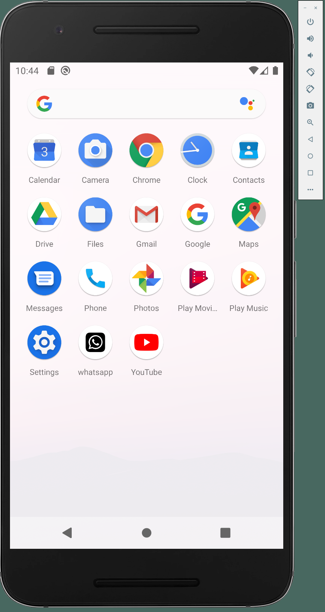
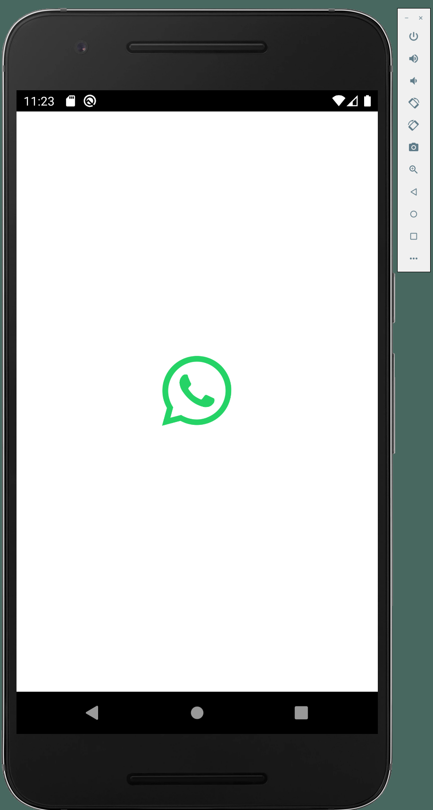

# whatsapp

A new Flutter project.


## 1) 앱 아이콘 변경


  


## 2) Splash 페이지 설정

### 2-1) Splash 에 사용할 이미지 셋팅

assets > images 폴더 하위에 splash 이미지를 저장하여 사용한다.

```md
📦 assets
 ┗ 📂 images
 ┃ ┣ 📜 splash_dark.png
 ┃ ┗ 📜 splash_light.png
```


### 2-2) flutter_native_splash.yaml 파일 설정

`pubspec.yaml` 에 작성하여도 되고 아래와 같이 `flutter_native_splash.yaml` 로 따로 작성하여도 된다.

```yaml
// flutter_native_splash.yaml

flutter_native_splash:
  color: "#ffffff"
  color_dark: "#121212"
  # branding: assets/images/splash_light.png
  # branding_dark: assets/images/splash_dart.png
  image: assets/images/splash_light.png
  image_dark: assets/images/splash_dark.png

  android_12:
    color: "#ffffff"
    color_dark: "#121212"

    image: assets/images/splash_light.png
    image_dark: assets/images/splash_dark.png
    icon_background_color: "#ffffff"
    icon_background_color_dark: "#121212"

  web: true
```


### 2-3) fluterr_native_splash 패키지 명령어 실행

해당 명령어를 실행하지 않으면 Splash 이미지와 설정을 잘 작성하였더라도 Splash 페이지가 뜨지 않는다.
```bash
  flutter pub run flutter_native_splash:create
```


해당 명령어를 실행하면 아래와 같이 기본/다크 모드 Splash 페이지가 플랫폼별로 생성되는것을 확인 할 수 있다.

```bash
CHLee@ChLEE MINGW64 ~/Dev/chlee-repo/flutter/flutter_clone_coding/whatsapp (main)    
$ flutter pub run flutter_native_splash:create
[Android] Creating default splash images
[Android] Creating dark mode splash images
[Android] Creating default branding images
[Android] Creating dark mode branding images
[Android] Creating default android12splash images
[Android] Creating dark mode android12splash images
[Android] Updating launch background(s) with splash image path...
[Android]  - android/app/src/main/res/drawable/launch_background.xml
[Android]  - android/app/src/main/res/drawable-night/launch_background.xml
[Android]  - android/app/src/main/res/drawable-v21/launch_background.xml
[Android]  - android/app/src/main/res/drawable-night-v21/launch_background.xml       
[Android] Updating styles...
[Android]  - android/app/src/main/res/values-v31/styles.xml
[Android] No android/app/src/main/res/values-v31/styles.xml found in your Android project
[Android] Creating android/app/src/main/res/values-v31/styles.xml and adding it to your Android project
[Android]  - android/app/src/main/res/values-night-v31/styles.xml
[Android] No android/app/src/main/res/values-night-v31/styles.xml found in your Android project
[Android] Creating android/app/src/main/res/values-night-v31/styles.xml and adding it to your Android project
[Android]  - android/app/src/main/res/values/styles.xml
[Android]  - android/app/src/main/res/values-night/styles.xml
[iOS] Creating  images
[iOS] Creating dark mode  images
[iOS] Creating  images
[iOS] Creating dark mode  images
[iOS] updating constraints with splash branding
[iOS] Updating ios/Runner/Info.plist for status bar hidden/visible
[Web] Creating images
[Web] Creating images
[Web] Creating images
[Web] Creating images
[Web] Creating background images
[Web] Creating CSS
[Web] Updating index.html
╔════════════════════════════════════════════════════════════════════════════╗
║                                 WHAT IS NEW:                               ║       
╠════════════════════════════════════════════════════════════════════════════╣       
║ You can now keep the splash screen up while your app initializes!          ║       
║ No need for a secondary splash screen anymore. Just use the remove()       ║       
║ method to remove the splash screen after your initialization is complete.  ║       
║ Check the docs for more info.                                              ║       
╚════════════════════════════════════════════════════════════════════════════╝       

✅ Native splash complete.
Now go finish building something awesome! 💪 You rock! 🤘🤩
Like the package? Please give it a 👍 here: https://pub.dev/packages/flutter_native_splash
```

| 주의 사항 : 만약 Splash 페이지의 설정을 수정하게 된다면, 수정사항이 반영될 수 있도록 위의 명령어를 한번 더 실행시켜줘야 한다.


### 3) Splash 페이지 완성

  


## MediaQuery 사용
> 디바이스별로 달라지는 width 를 대응하기 위해 MediaQuery 를 사용한다.


### 1) MediaQuery > Width 대응하기

```dart

SizedBox(
  width: MediaQuery.of(context).size.width - 100
  height: 42
  . . .
)


```

### 2) MediaQuery > Height 대응하기

```dart

SizedBox(
  width: 100
  height: MediaQuery.of(context).size.height - 100
  . . .
)


```
